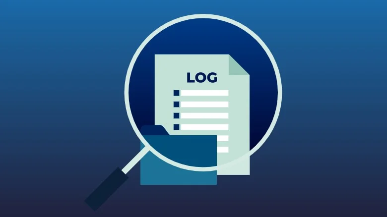
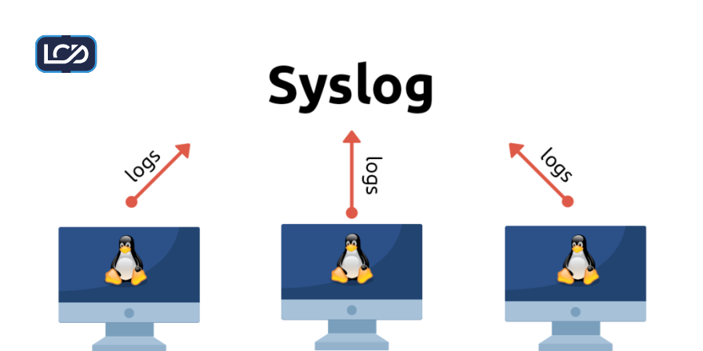

# 3. Endpoint Protection Tools


Endpoint protection ensures that the system is continuously monitored, malware is detected, and potential intrusions are identified.  
This helps maintain the integrity, availability, and confidentiality of the Linux endpoint.

## 3.1 Audit & Monitoring



Audit & Monitoring ensures all system activities are tracked and logged for security analysis, anomaly detection, and compliance.  
This phase focuses on **Auditd** for detailed system auditing and **Syslog** for centralized log collection.

### 3.1.1 Auditd (System Activity Logging)


**Auditd** is the Linux Audit Daemon, responsible for tracking system events such as user logins, file access, and command executions.

**Install Auditd**

```bash
sudo apt update
sudo apt install auditd audispd-plugins -y
```

**Enable and start the service**

```bash
sudo systemctl enable auditd
sudo systemctl start auditd
```

**Enable and start the service**

```bash
sudo systemctl enable auditd
sudo systemctl start auditd
```

**Verify service status**

```bash
sudo systemctl status auditd
```

**Example: Monitor changes to /etc/passwd**

```bash
sudo auditctl -w /etc/passwd -p wa -k passwd_changes
```
- `-w` → watch file
- `-p wa` → monitor write and attribute changes
- `-k` → assign a key for easier searching

**View audit logs**

```bash
sudo ausearch -k passwd_changes
```

### 3.1.2 Syslog (Centralized Logging)



**Syslog** collects and stores system logs, which can also be forwarded to a central logging server for monitoring.

**Install Syslog**

```bash
sudo apt install rsyslog -y
```

**Enable and start the service**

```bash
sudo systemctl enable rsyslog
sudo systemctl start rsyslog
```

**Verify service status**

```bash
sudo systemctl status rsyslog
```

**Forward logs to a central server**

```bash
sudo nano /etc/rsyslog.d/50-default.conf
```

Add on the top file this:
```bash
*.* @@central-logging-server-ip:514
```

**Restart rsyslog to apply changes**

```bash
sudo systemctl restart rsyslog
```

**✅ Why this is important:**

- **Auditd** provides detailed tracking of system events, enabling detection of unauthorized access or configuration changes.
- **Syslog** ensures logs are collected centrally, making analysis, alerting, and compliance easier.
- Together, they provide **real-time monitoring, accountability, and incident response capabilities** for the Linux endpoint.

## 3.2 Malware & Threat Detection


Malware and threat detection ensures the Linux endpoint is protected from viruses, trojans, and rootkits.  

This phase focuses on **ClamAV** for antivirus scanning and **Rkhunter** for rootkit detection.

### 3.2.1 ClamAV (Antivirus)


**ClamAV** is an open-source antivirus engine designed to detect malware, viruses, and other threats on Linux systems.

**Installation:**
```bash
sudo apt update
sudo apt install clamav clamav-daemon -y
```

**Update virus definitions:**
```bash
sudo freshclam
```

**Recommended Daily Scan Directories:**

- User files: `/home`
- Temporary files: `/tmp`, `/var/tmp`
- Web server content: `/var/www` (if hosting websites)
- Mail directories: `/var/mail`, `/var/spool/mail`
- Removable media: `/media`, `/mnt`

**Scan a directory:**
```bash
clamscan -r /home
```
- `-r` → recursively scan directories

**(optional) Scan and remove infected files:**
```bash
clamscan -r --remove /home
```

**Daily Scan Script Example:**
```bash
#!/bin/bash
# Daily ClamAV scan
SCAN_DIRS="/home /tmp /var/tmp /var/www /var/mail"
LOG_FILE="/var/log/clamav/daily-scan.log"

# Perform recursive scan and log results
clamscan -r --quiet --log=$LOG_FILE $SCAN_DIRS
```

**Enable automatic daily scans:**
```bash
sudo nano /etc/cron.daily/clamav-scan
```
Add your scan script and make it executable:
```bash
sudo chmod +x /etc/cron.daily/clamav-scan
```

### 3.2.2 Rkhunter (Rootkit Detection)


**Rkhunter** scans for rootkits, backdoors, and local exploits that may compromise system integrity.

**Installation:**
```bash
sudo apt install rkhunter -y
```

**Update database:**
```bash
sudo rkhunter --update
```

**Run a scan:**
```bash
sudo rkhunter --check --report-warnings-only --logfile /var/log/rkhunter/daily.log
```

**Automate Daily Scans:**
```bash
#!/bin/sh
# /etc/cron.daily/rkhunter
LOG_FILE="/var/log/rkhunter/daily.log"

/usr/bin/rkhunter --cronjob --update --quiet
/usr/bin/rkhunter --check --report-warnings-only --logfile $LOG_FILE
```

Make it executable:
```bash
sudo chmod +x /etc/cron.daily/rkhunter
```

**✅ Why this is important:**

- **ClamAV** scans files and directories for malware, protecting user data and system integrity.
- **Rkhunter** detects rootkits and hidden exploits that could compromise the system.
- **Daily automated logging** ensures continuous monitoring and provides a historical record for incident analysis.
- Together, they create **layered protection**, improving endpoint security and SOC visibility
