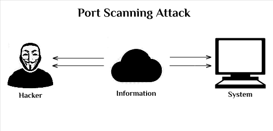

# 4. Network Security


Network security protects the Linux endpoint from malicious network activity, unauthorized access, and suspicious traffic patterns.  
This module uses **Suricata** for intrusion detection and **psad** for detecting port scans and network reconnaissance.

---

## 4.1 Suricata IDS (Intrusion Detection System)


**Suricata** is an open-source network IDS/IPS that monitors network traffic, detects intrusions, and logs suspicious activity.

### 4.1.1 Installation

```bash
sudo apt update
sudo apt install suricata -y
```

### 4.1.2 Enable and start Suricata

```bash
sudo systemctl enable suricata
sudo systemctl start suricata
```

### 4.1.3 Verify status

```bash
sudo systemctl status suricata
```

### 4.1.4 Configure Suricata for local traffic monitoring

- Edit interface configuration:
```bash
sudo nano /etc/suricata/suricata.yaml
```

- Set your main network interface (e.g., `eth0`) under `af-packet` or `interface`.
- Apply local rules in `/etc/suricata/rules/local.rules`:
```text
alert tcp any any -> any 22 (msg:"SSH connection detected"; sid:1000001;)
alert icmp any any -> any any (msg:"ICMP packet detected"; sid:1000002;)
```

### 4.1.5 View alerts

```bash
sudo tail -f /var/log/suricata/fast.log
```

**Best Practices:**

- Keep Suricata rules updated.
- Focus on monitoring **critical services** like SSH, HTTP, and network ports exposed to the Internet.
- Regularly review logs for suspicious traffic.

**✅ Why this is important:**
- **Real-time monitoring** of inbound and outbound traffic.  
- **Detects intrusion attempts** such as brute-force SSH, web exploits, or suspicious ICMP.  
- Provides **detailed logs and alerts** that can be correlated with system logs (Auditd, Wazuh).  
- Strengthens the **SOC visibility** of network-layer threats.  


---

## 4.2 psad (Port Scan Detection)



**psad** is a lightweight tool that **detects and analyzes port scans** and suspicious traffic using iptables logs.

### 4.2.1 psad Installation

```bash
sudo apt install psad -y
```

### 4.2.2 Enable and start psad

```bash
sudo systemctl enable psad
sudo systemctl start psad
```

### 4.2.3 Update psad signature and configuration

```bash
sudo psad --sig-update
sudo nano /etc/psad/psad.conf
```
- Configure alerting and logging (by default logs are in `/var/log/psad/`).

### 4.2.4 Check for detected scans

```bash
sudo psad --Status
sudo tail -f /var/log/psad/psad.log
```

**Best Practices:**

- Combine psad with iptables firewall rules for automated blocking of malicious hosts.
- Review port scan alerts regularly to detect reconnaissance attempts.
- Useful for monitoring SSH brute-force attempts, web server scans, and unauthorized access probes.

**✅ Why this is important:**
- **Early warning system** for reconnaissance attempts (attackers scanning for open ports).  
- Helps identify **suspicious hosts** before they launch full attacks.  
- Complements Suricata by focusing on **scan and probing activity** rather than deep packet inspection.  
- Provides **forensic evidence** in case of attempted intrusions.  