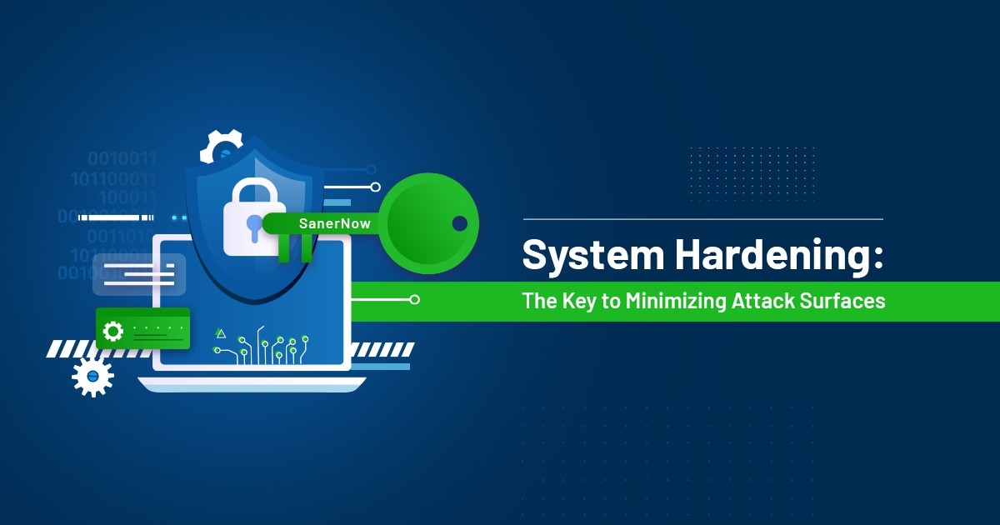
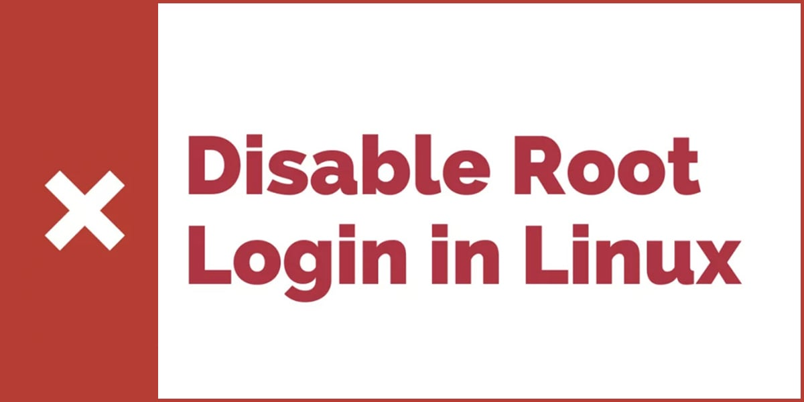
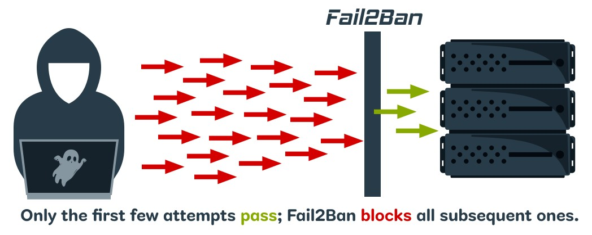
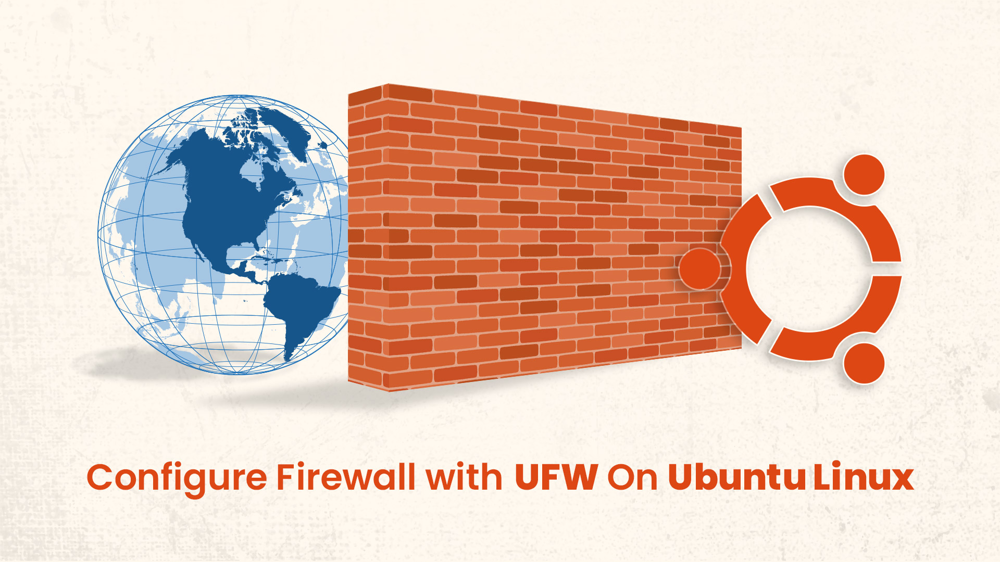
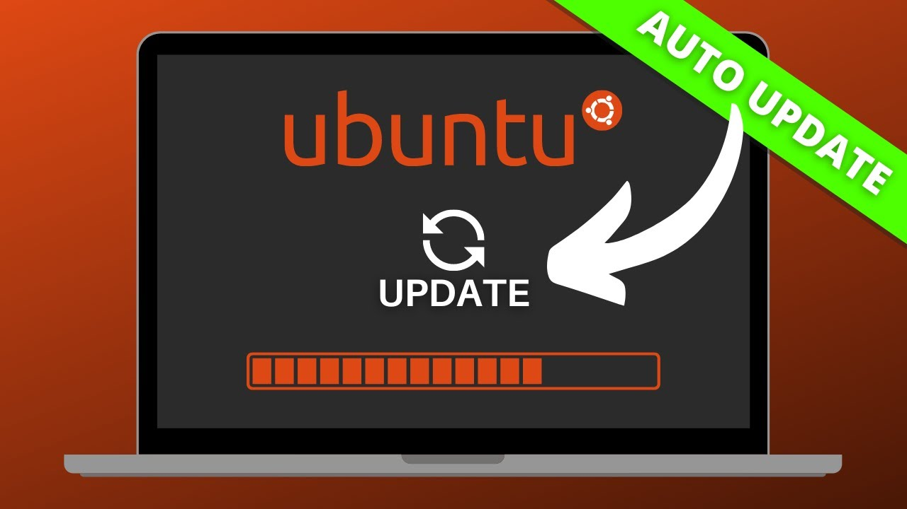

# 1. System Hardening



**System Hardening** is the **process of securing a Linux endpoint** by reducing its attack surface, enforcing strong access controls, and applying security best practices.  
This includes disabling risky defaults, configuring firewalls, enforcing secure authentication, removing unnecessary services, and keeping the system up to date with patches.  

The goal is to make the system more resilient against unauthorized access, malware, and potential breaches while ensuring proper monitoring and accountability.

## 1.1 Disable Root Login over SSH



Direct root login over SSH is a common attack vector. Disabling it improves security by enforcing the principle of least privilege and making unauthorized access harder.

### 1.1.1 Create a non-root admin user

```bash
sudo adduser adminuser
sudo usermod -aG sudo adminuser
```

### 1.1.2 Edit SSH configuration

**Edit the ssh configuration file:**
```bash
sudo nano /etc/ssh/sshd_config
```

**Set the following:**
```nginx
PermitRootLogin no
```

### 1.1.3 Restart SSH service

```bash
sudo systemctl restart ssh
```

**✅ Why this is important:**

- Prevents attackers from targeting the root account directly.
- Forces use of individual user accounts, improving **accountability and audit logging**.
- Reduces the attack surface for brute-force or password-guessing attempts.

## 1.2 Enforce SSH Key Authentication + Fail2Ban



SSH key-based authentication is a secure alternative to passwords. Combined with Fail2Ban, it protects the server against brute-force attacks.

### 1.2.1 Generate SSH Key Pair (on local machine)

```bash
ssh-keygen -t ed25519 -C "your_email@example.com"
```
- Accept default location (`~/.ssh/id_ed25519`).
- Optionally, set a passphrase for added security.

### 1.2.2 Copy Public Key to Server

```bash
ssh-copy-id adminuser@<VM_IP>
```
- Replaces `<VM_IP>` with your server’s IP.
- This appends your public key to `/home/adminuser/.ssh/authorized_keys`.

### 1.2.3 Verify SSH Key Login

```bash
ssh adminuser@<VM_IP>
```
- You should **log in without entering a password**.

### 1.2.4 (Optional) Disable Password Authentication 

**Edit the ssh configuration file:**
```bash
sudo nano /etc/ssh/sshd_config
```

**Set the following:**
```nginx
PasswordAuthentication no
```

**Restart the ssh service:**
```bash
sudo systemctl restart ssh
```

### 1.2.5 Install and Configure Fail2Ban

```bash
sudo apt update && sudo apt install fail2ban -y
sudo nano /etc/fail2ban/jail.local
```

**Example configuration for SSH:**
```ini
[sshd]
enabled = true
port    = ssh
filter  = sshd
logpath = /var/log/auth.log
maxretry = 3
bantime = 1h
```

```bash
sudo systemctl enable fail2ban
sudo systemctl start fail2ban
sudo fail2ban-client status sshd
```

- You should see like this output:

```bash
Status for the jail: sshd
|- Filter
|  |- Currently failed:	0
|  |- Total failed:	0
|  `- Journal matches:	_SYSTEMD_UNIT=sshd.service + _COMM=sshd
`- Actions
   |- Currently banned:	0
   |- Total banned:	0
   `- Banned IP list:	
```

**✅ Why this is important:**

- **SSH keys** are much harder to brute-force than passwords.
- **Fail2Ban** automatically blocks IPs after repeated failed login attempts.
- Together, they **greatly reduce the risk of unauthorized access** and protect the server from brute-force attacks.

## 1.3 Configure Firewall (UFW / iptables)



A firewall is a critical layer of defense that controls which network traffic is allowed to reach the system.  
By default, all unnecessary connections should be denied, and only essential services explicitly permitted. 

### 1.3.1 Install UFW (if not already installed)

```bash
sudo apt update
sudo apt install ufw -y
```

### 1.3.2 Set Default Policies

**Deny everything by default, then allow only what’s needed:**
```bash
sudo ufw default deny incoming
sudo ufw default allow outgoing
```

### 1.3.3 Allow Only Secure Services

```bash
sudo ufw allow ssh       # Allow SSH
sudo ufw allow 80/tcp    # Allow HTTP (if you plan a web server)
sudo ufw allow 443/tcp   # Allow HTTPS
```

### 1.3.4 Enable the Firewall

```bash
sudo ufw enable
```

**Confirm:**
```bash
sudo ufw status verbose
```

**Expected output:**
```bash
Status: active
To                         Action      From
--                         ------      ----
22/tcp                     ALLOW       Anywhere
80/tcp                     ALLOW       Anywhere
443/tcp                    ALLOW       Anywhere
```

### 1.3.5 Add Rate Limiting (Extra Security)

**To slow down brute force attacks on SSH:**
```bash
sudo ufw limit ssh/tcp
```

### 1.3.6 (Optional) Iptables Extra Hardening

**If you want advanced control beyond UFW:**
```bash
sudo iptables -A INPUT -p tcp --dport 22 -m conntrack --ctstate NEW -m recent --set
sudo iptables -A INPUT -p tcp --dport 22 -m conntrack --ctstate NEW -m recent --update --seconds 60 --hitcount 4 -j DROP
```
- This blocks IPs with more than 3 SSH attempts in 60 seconds.

**✅ Why this is important:**

- **Restricts access** by only allowing essential services (SSH, HTTP, HTTPS).  
- **Reduces attack surface** by blocking unused and vulnerable ports.  
- **Mitigates brute-force attempts** with rate limiting on SSH.  

## 1.4 Apply automatic updates & patches



Keeping a server updated is **critical for security**. Most exploits target known vulnerabilities, and unpatched systems are the easiest targets. As a system administrator, enabling automatic updates ensures that security patches are applied quickly without manual intervention.

### 1.4.1 Install the Unattended-Upgrades package

```bash
sudo apt update
sudo apt install unattended-upgrades apt-listchanges -y
```

### 1.4.2 Enable Automatic Updates**

**Run the configuration tool:**
```bash
sudo dpkg-reconfigure --priority=low unattended-upgrades
```
- Select **Yes** when asked to automatically download and install stable updates.

### 1.4.3 Verify the Configuration

**Check the configuration file:**
```bash
cat /etc/apt/apt.conf.d/20auto-upgrades
```

**You should see something like:**
```bash
APT::Periodic::Update-Package-Lists "1";
APT::Periodic::Unattended-Upgrade "1";
```

**✅ Why this is important:**

- **Closes known vulnerabilities** quickly by applying patches.
- **Reduces human error** — no need to remember manual updates.
- **Minimizes attack window** before an exploit can be used.
- **Keeps the system compliant** with best security practices.

## 1.5 Remove Unnecessary Services and Packages

Minimizing the number of installed services is one of the most effective hardening practices.
Every running service is a potential entry point for attackers, so disabling or removing unused software reduces risk.

### 1.5.1 List Active Services

**Check what’s running:**
```bash
sudo systemctl list-unit-files --type=service --state=enabled
```
- This shows which services start automatically at boot.

### 1.5.2 Disable Unnecessary Services

**If you find a service you don’t need (example: `cups` for printing), disable and stop it:**
```bash
sudo systemctl disable cups
sudo systemctl stop cups
```

### 1.5.3 Remove Unneeded Packages

**Check installed packages and remove unused ones:**
```bash
sudo apt list --installed
sudo apt remove --purge <package-name>
```
### 1.5.4 Clean Up**

**Remove residual config files and unused dependencies:**
```bash
sudo apt autoremove -y
sudo apt autoclean -y
```

**✅ Why this is important:**

- **Reduces attack surface** by eliminating unnecessary software.
- **Frees system resources** (CPU, RAM, storage).
- **Prevents vulnerabilities** from unused but exploitable services.
- **Simplifies monitoring** by keeping only essential services active.
