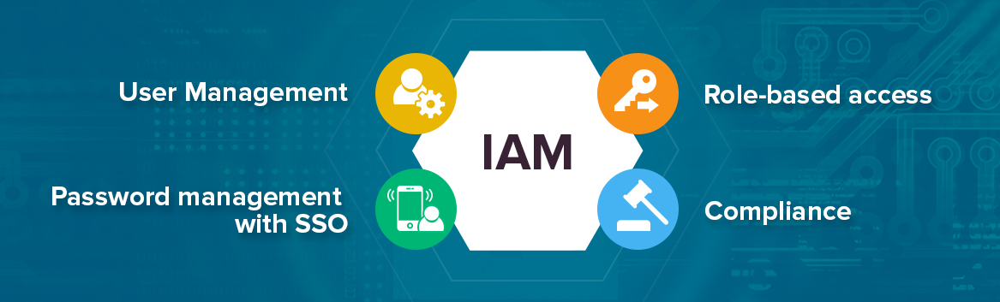

# 2. User & Access Management



User and access management is the practice of controlling who can access the system, what they can do, and how their actions are tracked.  
It ensures that only authorized users are granted access, with the principle of least privilege applied to minimize risk.

The goal is to prevent unauthorized access, limit potential damage from compromised accounts, and maintain accountability for every action performed on the system.

---

## 2.1 Create Admin User with Sudo Privileges


Instead of using the `root` account directly (which is risky), we create a dedicated **admin user** with **sudo privileges**.

This ensures all administrative actions are logged, and root access is only obtained when explicitly required.

### 2.1.1 Create a New User

```bash
sudo adduser adminuser
```
- You’ll be prompted to set a password and optional details (name, room number, etc.).

### 2.1.2 Add the User to the Sudo Group

```bash
sudo usermod -aG sudo adminuser
```

### 2.1.3 Verify Sudo Access

**Switch to the new user:**
```bash
su - adminuser
```

**Run a sudo command:**
```
sudo whoami
```

**Expected output:**
```bash
root
```

**✅ Why this is important:**

- **Avoids direct root login**, reducing exposure to brute-force attacks.
- **Provides accountability** since each admin has their own account.
- **Enforces least privilege**, as normal tasks can be run without root.
- **Improves security monitoring** by logging all privileged actions through `sudo`.

---

## 2.2 Enforce Password Policies (PAM)


To strengthen authentication security, we use **PAM (Pluggable Authentication Modules)** to enforce **strong password policies**.
This ensures that user passwords are not weak, reused, or easily guessable, making brute-force and credential-stuffing attacks less effective.

### 2.2.1 Install the `libpam-pwquality` Module

```bash
sudo apt install libpam-pwquality -y
```

### 2.2.2 Configure Password Policies

**Edit the PAM configuration file:**
```bash
sudo nano /etc/pam.d/common-password
```

**Find the line containing:**
```ruby
password   requisite    pam_pwquality.so retry=3
```

**Modify or add rules such as:**
```ruby
password   requisite    pam_pwquality.so retry=3 minlen=12 ucredit=-1 lcredit=-1 dcredit=-1 ocredit=-1
```

**Explanation:**

- `minlen=12` → minimum 12 characters
- `ucredit=-1` → at least 1 uppercase letter
- `lcredit=-1` → at least 1 lowercase letter
- `dcredit=-1` → at least 1 digit
- `ocredit=-1` → at least 1 special character

### 2.2.3 Configure Password Expiration & History

**Edit `/etc/login.defs`:**
```bash
sudo nano /etc/login.defs
```

**Recommended settings:**
```nginx
PASS_MAX_DAYS   90      # Force password change every 90 days
PASS_MIN_DAYS   7       # Prevent immediate password changes
PASS_WARN_AGE   14      # Warn users 14 days before expiry
```

**Enforce password history (prevent reuse):**
```bash
sudo nano /etc/pam.d/common-password
```

**Add this line:**
```ruby
password required pam_unix.so remember=5
```

### 2.2.4 Test the Policy

**Change the password:**
```bash
passwd adminuser
```
- Try weak passwords and confirm they’re rejected.

**✅ Why this is important:**

- **Prevents weak passwords** that attackers can easily guess.
- **Forces password rotation** to reduce risk of compromised accounts.
- **Stops password reuse**, limiting impact of leaked credentials.
- **Adds multiple layers of complexity** (uppercase, digits, symbols) making brute-force attacks far less effective.

---

## 2.3 Implement Least Privilege Access (RBAC)


**Role-Based Access Control (RBAC)** ensures that users have **only the permissions necessary** to perform their job.

This limits the potential damage from compromised accounts and reduces the risk of accidental or malicious changes.

### 2.3.1 Create Groups for Roles

**For example, define groups for different access levels:**
```bash
sudo groupadd dev       # Developers
sudo groupadd ops       # Operations
sudo groupadd auditors  # Read-only auditing
```

### 2.3.2 Assign Users to Groups

```bash
sudo usermod -aG dev alice
sudo usermod -aG ops bob
sudo usermod -aG auditors charlie
```
- Use `-aG` to append users to groups without removing existing group memberships.

### 2.3.3 Set Permissions Based on Groups

**Limit file or directory access using `chown` and `chmod`:**
```bash
# Make /srv/dev only accessible to dev group
sudo chown root:dev /srv/dev
sudo chmod 770 /srv/dev

# Make /srv/audit read-only for auditors
sudo chown root:auditors /srv/audit
sudo chmod 750 /srv/audit
```

### 2.3.4 Restrict Sudo Privileges

**Edit the sudoers file safely:**
```bash
sudo visudo
```

**Example rules:**
```bash
# Only ops group can restart services
%ops ALL=(ALL) NOPASSWD: /bin/systemctl restart *

# Dev group can only deploy scripts in /srv/dev
%dev ALL=(ALL) NOPASSWD: /usr/bin/bash /srv/dev/deploy.sh
```

### 2.3.5 Verify Access

```bash
# Switch to a user and test
su - charlie
ls /srv/dev        # Should be denied
```

**✅ Why this is important:**

- **Reduces risk** by limiting what each user can do.
- **Prevents accidental damage** from users with unnecessary privileges.
- **Protects sensitive data** by isolating access to only relevant files/services.
- **Improves auditing and accountability**, making it clear who did what.